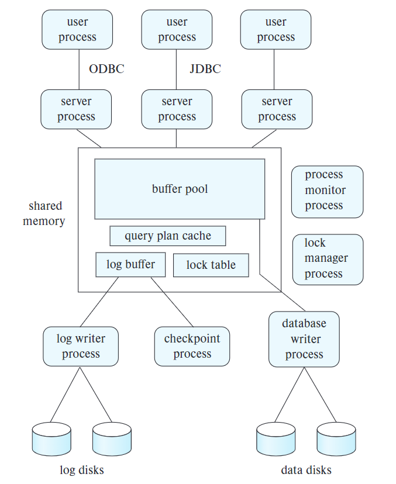
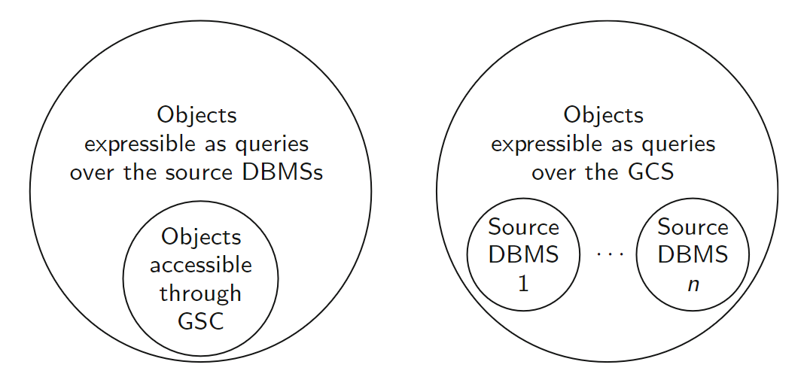
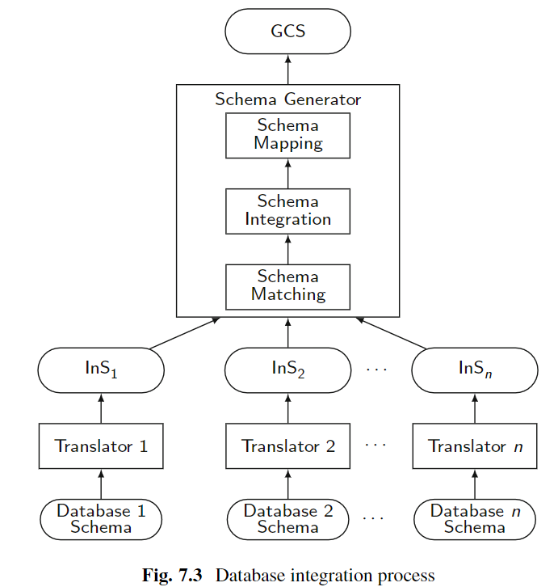
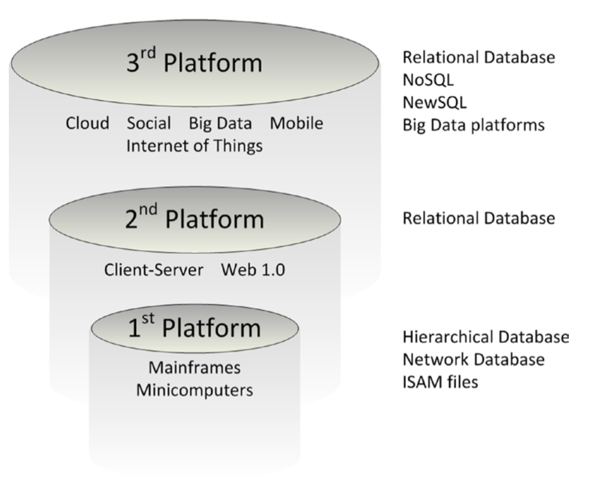

# 20. Database-System Architectures
* The database architecture is influenced by the underlying hardware and any needed capalilities like parallelism and distribution.

## Centralized Database Systems
* Runs on a single computer system.
* Can be a mobile device or a multi CPU system with large storage.

Have **single-user system** where the system is accesseed by only one person and the system usualy consist of a single cpu and 1-2 disks. A **multiuser system** Is used by multiple users and has multiple disks, more storage and more memory. These are accessed remotely and are called server systems. 

**Embedded databases** are database systems where an API is used to access the database instead of writing SQL queries. Fault tolerance on these systems might be low or absent. 

## Server System Architectures
* **Transaction-server** (**query-server**) systems, users send SQL or ORM requests to server who executes the query and sends back the result.
* **Data-server** systems, clients can interact with the servers to do CRUD operations to files, pages or objects. The data can be as small as just a tuple. These servers provide indexing capabilities and makes sure to keep the data consistant. 

### Transaction-Server Architecture

* **Server process**, receive queries, execute them and send the result back. Might be multiple to handle each user or a single process with many threads, or a hybrid. 
* **Lock manager process**, grants/releases locks and detects deadlocks. 
* **Database writer process**, processes that writes modified blocks to disk.
* **Log writer process**, writes logs from the shared memory buffer to stable storage. 
* **Checkpoint porcess**, performs checkpointing.
* **Process monitor process**, moitors other processes. Takes appropriate actions if a process fails.

The transaction server acts as a first contact that ensures the completion of the transaction. The transaction server will contact the database.

The locks are handled either via explicit requests for the locks or thorough atomic operations like test-and-set or compare-and-swap. 

### Data Servers and Data Storage Systems 
These systems originally stores OOP objects. It is hard for the server to do the computation required to create the objects which can be 3D-rendering. Instead the client creates the object and the server stores it. Data servers may store, files, documents, objects or tuples. The data items may be represented as JSON, XML, files or documents. 

### Caching at Clients
Goal: reduce communication overhead caused by network latency. Strategies:
* **Prefetching**. When a request comes in, send the requested data as well as other data that it is expected that the client will request later.
* **Data caching**. Cache data items at the client. Must add some mechanism to handle cache coherency if stale data is a problem.
* **Lock caching**. If a client has cached the desired data item as well as the lock to it, it avoids sending a request to the server. The server must then orchistrate all client locks and do a **call back** whenever a client asks for a data item which another client has cached the lock for. Problem with clients with locks that have failed.
* **Adaptive lock granularity**. Instead of locks on single data items, use locks on for example entire pages. Works good when little contest on locks. Can have **lock deescalation** to create more finer coarsed granulairty on locks when there are more contestion. 

## Parallel Systems
Queries on huge data requires more processing. Do parallelism.

### Measure of Performance for Parallel Systems
* **Thorughput**, number of tasks that can be completed in a given time interval.
* **Response time**, the amount of time it takes to complete a single task from the time it is submitted.

**Speedup** is the decrease in time form parallelism and **scaleup** os the degree of parallelism. 

* **Batch scaleup**, database size increase and the tasks are large jobs whose rumtime depends on the size of the database. 
* **transaction scaleup**, the transaction rate increases and the size of the database increases proporionally to the rate. 

### Parallel Database Architectures
* **Shared-memory** 
Requiers connections between nodes which limits the number of cores that can be interconnected.
* **Shared-disk** (cluster)  
Scales better but communication across ndoes is slower compared to shared-memory.
* **Shared-nothing** (all nodes have their own resources)  
Scalable as I/O connections are not shared and a large number of nodes can be supported. Drawbacks are communication overhead and nonlocal disk access.
* **Hierarchical** (hybrid of the previous three)  
Might have shared-nothing at the top, shared-disk in the middle and shared-memory at the bottom.

Most used today is a combination with shared-nothing at the top.

## Distributed Systems
Database is stored on nodes located at geographically separate sites. Shared-nothing architecure.

Emphasis on handling failures. has separeate owners/administrators and may be in different authorative sites. 

In a **homogeneous distributed database** each node operates on the same global schema, although they might store separate relations of that schema. They also run the same DBMS and coopreate in processing transactions and queries.
In **hetrogeneous distributed database systems** the nodes have different schemas and even possibly DMBS. Their cooperation capabilities might be limited. 
In the latter it can bemore difficult to find data and distribute workload.

## Transaction Processing in Parallel and Distributed Systems
Must avoid transaction is completed at one node but failes at another. In the **two-phase commit protocol (2PC)**, a trancation will enter a partially committed state after execution. It will then be up to a coordinater to commit the transaction or abort it. If each node has reached a ready stage, meaning each nodes has received the message and is ready to execute, the coodinator will send out a commit message to the nodes. A node who crashed while in the reasy state should be able commit or abort the transaction. 

# 21. Parallel and Distributed Storage
Data storage and indexing in parallel databases.

## Data Partitioning
Reducing disk access time py partitioning data accross multiple disks. **Horizontal partition** is to partition the tuples of a relation is split among the nodes. Considering a single tuple, this tuple with fields A, B and C might be split such that (A, B) is stored on one node and (A, C) is stored on another. The spliting strategy might be based on some element beeing large and infrequently accessed so we partition the tuple without that element in one node for faster access. **Vertival spartition** is to spread whole tuples.

Partition strategies: 
* **Round-robin**, each tuple is assigned to a node in a round.robin fashion. Good for sequential scans. 
* **Hash partitioning**, relation is hashed on the partition attributes of the relation. The tuple, based on the hash of the attributes, is designated the node indicated by the value of the hash. Good for single criteria searches. 
* **Range partitioning**, distributes tuples by looking at the value of attributes. Each node is then assgined some range for the attribute and given that the tuple's value for this attribute is within a nodes range, the tuple is assigned to that node. *(if we want to distribute the tuples for faster retreival, why assign all tuples within a range to one node when we often eant to retreive tuples within a range? It seems we will often hit alot of tuples within the same node)*. This will occur is a large range hits only a few nodes and we get an **execution skew** as much processing is done on only a few nodes. But generaly good for range and point searches. 

## Dealing with Skew in Paritioning
* **Attribute-value skew**, alot of tuples has the same value for the partitioning attribute.
* **Partition skew**, load imbalance in the partitioning, even with no attribute skew. 
Can also have **execution skew** where most queries hit a small poriton of the nodes, like with range partition on timestamps and most queries requests the lastest tuples. 

To balance a range partition, given that we want $n$ splits, the attribute partition sorted relation is scanned and split at each $1/n$ interval. Drawback: is static and would like to recompute the balancing at some point. To handle this, can use virtual nodes that are more in numbers than the physical nodes. The tuples are then mapped to virtual nodes and the virtual nodes is mapped to physical ones, possibly in a round-robin fashion. We can then map the virtual nodes to physical ones on the fly to balance the system. it also enables **elasticity of storage**, if more compute is needed, a new node can be set up and virtual nodes are mapped to this new physical one. 

This does however not address the imbalance is execution where some ranges or points are access more frequently. This can be fixed by something that looks like a B$^+$-tree where a vitrual node is split and assigned to different physical nodes. A partition table is used to index the split tables to real nodes. 

## Replication
Each partition of the relation shown in the partition table can have multiple nodes listed where each node has the data for a given key. For best replication speed, having the replicas within the same data center or even the same rack is the fastest. To handle disasters like fire or flooding, the replicas should be dispersed accross data centers at different geo-locations. 

## Parallel Indexing
* **Local index**, build on tuples is a particular node and contents of index is stored on the same node as the data.
* **Global index**, built on data stored accross multiple nodes. Index is used to find tuples wherever they are. The contents of a global index should be partitioned accross multiple nodes.
* **Global secondary index**, an index on an attribute which is not the partition attribute. 

## Distributed File Systems
Stores files across a large collection of machines while giving a single-file-system view to clients (GFs, Hadoop, ...). Does not usually store as much data as the parallel storage does. Large files can be broken into multiple blocks and blocks might be dispersed across multiple nodes. The blocks are also replicated across multiple machines. 

HFDS uses a name node in order to find out where to get the blocks for a data item on a read as well s the replicas, and where to write the data items on a write. Replicas introduce consistency problems. HFDS handles this by only appending to a file, never updating existing items. Only when a file is successfully closed can it be read. This is called **write-once-read-many** access model. GFS supports updating. 

## Parallel Key-Value Stores
Problem: have possibly billions of small files which must be distributed over thousands of nodes, not very suitable for a distributed file system and the tech in 2000 did not support dynamic node networks. 

Basic: use put and get with value tuple.
Have different variations:
* Schema definition allowing to the column names.
* **Wide-column stores** where a column can be added as an attribute in the put or get call to use a specific column as well as giving an update and delete function. 
* **Document stores** which can store complex structures like JSON.

Does not have things like declerative queries, transaction support or efficient retreival.

### Data Representation
* Which data types
* Store rows together for fast row retreival or columns together for fast attribute retreival. 

### Storing and Retrieving Data
Use a master node that has information on where tablets (partition of relation) is stored. To minimize load on the master node, caching can be done at the client or at routers. If a router routes the client to a node that does not contain the data, the router fetches the up-to-date infromation on the splitting of the tablets. 

### Geo Distributed Storage
Used for fault tolerance. Several routers are used with a master node with copy of partition table and tablet mapping. The routers route the client to the tablet servers. There are different ways handling consistency, where some are more strict, requiering atomic operations while others allow more loose rules like eventual consistency. 

### Index Structure
Depends on structure. Immutable data servers cannot use a B+-tree as index although it is quite good. This since a B+-tree requires updating. 

### Transaction Support
Most key-value stores have limitd support for transactions. 

# 22. Parallel and Distributed Query Processing
## Overview
### Types of query parallelism
* **Interquery parallelism**, doing multiple queries in parallel with each other, across multiple nodes. This is essential for high traffic transaction servers. The throughput is high but individual query processing is the same. 
* **Intraquery parallelism**, doing different parts of a the execution of a query in parallel across multiple nodes. Essential for speeding up large long-running queries. Two types of work split that can be used in combination:
    * **Intraoperation parallelism**, is the act of dividing the operations of a query into single tasks that can be parallized. 
    * **Interoperation parallelism**, given the operator tree, operations that are independant of each other can be done by separate nodes. Two nodes can also work in parallel even though one depends on the output of the other, the depending node may be fed the output of the other node continiously as the output is genereated.

## Distributed Query Processing
Have geo distributed databases and need to query multiple of these.

### Data integration from Multiple Data Sources
 The databases might run different DMBS's and have differenct schemas. Some systems are up to date while others are legacy systems, which might be difficult to update. This requires an additional layer to be built on top of the database systems that gives the illusion of one logical view, called a **federeated database system**. 

 Databse integraiton can be done in different ways:
 * **Federated database**, creates a global schema (it is common among all databases where each database has its own local schema). This is called **schema integration**. This new global schema must be able to transelate queries into local schemas that can be run on the individual nodes, as well as transelate the result back to the global schema.
 * **Data virtualization**, allows application to access data from multiple databases but does not give the illusion of a single schema. Does, however, not need be aware of where the data is stored. 
 * **External data**, provides data from external data sources along with authentication informaiton needed for these external sites.

### Schema and Data Integration
**Schema integragion**, creating a unified view of the schema. Two sites may have different schemas, althought they essentially store the same data, the attributes may only be divided differently for different relations. Each site then computes the unified view of the schema based of the relation at the other sites, the global schema then becomes the union of these computes views at each site. This is called **global-as-view (GAV)**. The **local-as-view(LAV)** splits the data into multiple sites based on an attribute value. Differences in data types at the site is another problem. Also, different sites might have fields that are the same but might not have the same name possibly due to language differences.

### Query Processing Across Multiple Data Sources
Might be unreasonable to fetch an entire relation when a query only hits a small portion of the tuples. Processing should then be done at the target node.  There are problems like if three relations at three different sites are to be joined and the result shipped to a fourth site, who would best do these joins. This depends, one site could for example have a comprehensive index that supported this join and therefore should do the work. 

### Distributed Directory Systems
A directory contains a listing of information about some class or object. **Directory access protocols** are developed to provice a standardized way of accessing data in a directory (DNS for example). Directories are may be stored in a relational model but provides better support of directory structured data. 

# 10. Big Data
## Motivation
In particular web services grew a large data pool of user statistics and interactions which could be used for targeted advertisement.

Big data with relational databases have the following metrics:
* **Volume**, much more data than traditional databases were built to handle.
* **Velocity**, increase in expected processing time.
* **Variety**, not all data comes in the same form (relational, document, graph, etc.).

### Querying Big Data
Hard to create a realtional model supporting SQL while also scaling with parallelism of data and processing.

Two categories of application:
1. Transaction-processing systems that need very high scalability: Support short but many queries and updates. 
2. Query processing systems that need very high scalability, and need to support relational data: Typical application is analysis on logs generated by web servers.

## Big Data Storage Systems
Have a need to distribute data as the amount of data increases.

Big data storage systems:
* **Distributed file system**. 
* **Sharding across multiple databases**. Partitioning records across multipl e stystems.
* **Key-value stogare systems**. 
* **Parallel and distributed databases**

### Distributed file system
Supports:
* A directory system
* A mapping from file name to identifies blocks that store the data.

The Hadoop system built on GFS is a distributed file system where the **NameNode** maintains all mappings from file name/path to the block identifers in each file. Thus it also stores which **DataNodes** stores the data items. Writes are stored usually at three places, the master node and two other replicas.

### Sharding
Partitioning the data across multiple databases or machines to handle greater load. Can use range partitioning, hash partitioning. Hard to manage the partitioning of data.

### Key-value Storage Systems
Widely used more than sharding as is is easier to replicate and load balance compared to relational sharding.

### Parallel and Distributed Databases

## The MapReduce Paradigm
Apply a **map()** function on records then aggregate result of map function with **reduce()**.

The map function is applied to the records to create the appropriate input to the reduce function. If we are counting word occurances, the map function could break each word into a tuple ("word", count) or, in general, (*key*, *value*). All tuples with the same key or, *reduce key*, is grouped togheter to form a (*key*, *list*) tuple. The reduce function then aggregates the values in the *list* and outputs (*key*, *aggregate*). When this is done in parallel over several machines, a **shuffle step** is included in order to supply a machine with all tuples with the same key.

## Beyond MapReduce: Algebraic Operations
Want to express the sequence of steps going from a complex datasets as input and one or more complex output datasets in algebaric form.

### Algebraic Operations in Spark
Like in relational databases that use relations as the primary abstraction for data representation, Spark uses a reresenatation called a **Resilisent Distributed Dataset (RDD)**, which is a collection of records that can be stored across multiple machines. The content of the RDDs can be anyting and the operators in Spark take the RDDs as input and produces one or more RDDs as output.The MapReduce operations applied to the RDDs form a tree of operations. In general, an operation is fed to multiple other operations and in this case a **Directed Acrylic Graph (DAG)** structure is created as an operation will have more than one parent.  

Key chraracteristics about RDDs:
* **Lazy Evaluation**, Spark keeps track of transformations on data in a DAG and only executes the transforations when the output of those transformations are needed.
* **In-Memory Computation**
* **Fault Tolerance**, tracks data lineage.
* **Immutability**, safer in a parallel system.
* **Partitioning**, automatically distributes RDDs among nodes. 

## Streamig Data
Data that arrive in a continious fashion and that will be processed in real-time.

## Graph Databases
Uses nodes to store records and edges to imply relationships between nodes.

Neoj offeres:
* Special syntax for defining realtions between nodes.
* Query language to easily and efficiently express path queries.
* Supports graph visualization

To process graphs in parallel there are two popular approaches:
1. Map-reduce and algebraic frameworks. Graphs are represented as relations. Innefiicent as the graph is read many times.
2. **Buld synchronous processing frameworks (BSP)**. Vertecies are partitioned across multiple machines. A function is applied to each node, which is called a superstep, and the result may be communicated with the other nodes. This is done iteratively where all machines operate in steps, each processing the nodes in the step and waiting for all others to do the same before continuing. 

# 11. Data Analytics
Processing data to infer patterns, correlations, or models for prediction. The results are used to drive business decisions. Making the right decisions in predicting what the user wants and when it wants it can mean high increases in revenue. 
## Overview of Analytics
Efficient data processing by keeping the data in data warehouses under  a single schema. Today, warehouses also do non-relational when schema unification is not possible. **Online analytical processing (OLAP)** systems are popular as aggregate queries over lage data amounts can be almost instantanious. 
## Data warehousing
The data warehouse is a repositoty of information gathered form multiple sources, stored under a unificed schema, at a single site. Data is stored over long periods of time to support analytics that require past information. 

Issues of building a data warehouse:
* **When and how to gather data**
    * **Soruce-driven arch**, gather data continually or periodically (ati night for example).
    * **Destination-driven arch**, warehouse periodically sends requests to get new data from the sources.
* **What schema to use**, how to materialize data from different schemas into one view.
* **Data transformation and cleansing**, the task of preprocessing and correcting data.
* **How to propagate updates**
* **What to summarize**

The steps of getting data into a warehouse, **ETL**: Extract, transform and load.

### Multidimentional Data
**Facet tables** record information about indovidual events and the attributes of the facet table might be **measure attributes** (number of items sold and price) which can be aggregated on, or **dimension attributes** that are grouping of measure attributes (ID of sold item, date, location, etc). When measure and dimension attributes are combined we get **multidimensional data**. 
In the image below we have the measure attributes number and price in the sales table and the orher dimension attributes refference with foregin keys into **dimension tables**.

In transaction models, the data is often fetched on tuple by tuple basis. In data warehouses however, it is often just a single or few attribute collumns that are desired. Because of this, **column-oriented** storage is widely used. In contrast to row-oriented storage, files do not store whole tuples, but a file will store only one column which increases performance beacuse of the usage caractheristics of the data warehouse. 

**Data lakes** are, unlike data warehouses, just a pool of unstructured data. This removes the cost of creating a unified schema,but queries take longer to craft and execute.

## Online Analytical Processing
Looking for patterns that arise when data values are grouped in "interesting" ways.  

### Aggregation on Multidimensional data
Example databsae of clothing sales. In this case we can aggregate on the quantity sold which is a measure attribute and group on clothing size which is a dimension attribute. This can give a sum of quantity sold diregarding the slothing size. From this we can create a **pivot-table** which is a relation where a attribute A form the column headers, like the color of the clothing, and the row headers from another attribute B, like the type of clothing. This creates a 2D pivot-table or **cross-tab**. To do this in n dimensions a **data cube** is formed, for example each clothing size can be one slice in the cube. In a **OLAP**, the analyst can select any of the slices of this data cube to look at the quantity sold for a particular size. This is what the OLAP does, allowing the analyst to view aggregated data at different levels of granularity (**rollup** and **drill down**). 

### Reporting and Visualization Tools
OLAP provides functionality to produce human-readable reports and to use visualization tools to better understand the data. 

## Data Mining
Usefull for **predictions**, like if a client is applicable for a loan, or **associations** to for example find similar products to the one the user is currently interested in. 

* Decision-tree
* Bayes
* SVM with kernel trick for higher dims
* Neural nets
* Regression
* Clustering
* Assosiative rules
* Text mining

# 23. Parallel and Distributed Transaction Processing
## Overview
Transaction processing in parallel and distributed systems. Face problems like replication and failure of nodes. 
## Distributed Transactions
ACID transactions in local and global transactions (one or several databases are effected respectively). 
### System Structure
* **Transaction manager** handles the execution of transactions.
* **Transaction coodrinator** coordiantes the executuion of transactions initiated at that node.

### System Failure Modes
Additional faiulures in a distributed environment:
* Node failue
* Message loss
* Comm link failure
* Netowrk partition

## Commit Protocols
The transaction coordinator must make sure that either all nodes execute the transaction successfully, or the transaction is not executed at all.
### Two-phase Commit (2PC)
#### Phases
* **Phase 1**: The coordinator stores a log entry with the transaction to prepare. It then sends prepare on the transatction <"Prepare T"> to all nodes who originally executed the transaction. The nodes then respond with either yes or no and the coordinator stores the reponse. The nodes store their response to disk in case they fail.
* **Phase 2**: If the coordinator reveices a declined reponse from a node, the transaction in aborted and the coordinator sends an abort message to all nodes. This is also the case if the coordinator does not reveice an ok from all nodes. The coordinator can also decide to abort if it does not receive an ok from a node within some time frame. The coordiantor stores the verdict of the transaction and sends it to all participating nodes as well. The nodes store the outcome of the transaction to disk. There may be an extra step where the coordinator also receives a transaction completed response from the nodes afterwards. This way, a failing node may request the outcome of the transaction.
#### Handling failures
* **Participating node fails**:
    * **Fail before ready**: If the coodirnator does not reveice a ready message in phase 1. the coordinator aborts the transaction
    * **Fail after ready**: The cooridnator will in this case ignore the failed node and continue. If the coordiantor has stored the outcome of the transaction, the failing node may request the outcome after recovering. 
     
    If the recovered node finds that it has logged to commit (phase 2 completed) the transaction, it will redo the transaction. If is contains a ready on the transaction (phase 1), is will consult the coordinator for the outcome of the transaction and if it is unable to reach the coordinator, it will ask the other nodes in the network. If the node has no control record for the transaction, it undoes the transaction (it failed before responding to a prepare and thus the coordinator has aborted the tranasction).
* **Coordinator fails**:
    * If a nodes has a commit record for the transaction, then the transaction must be commited.
    * If a node does not have a ready record on the transaction, the transaction is preferably aborted.
    * If all nodes have a ready record on the transaction but nothing else, the nodes must wait and possibly block until the coordinator comes back up which is not desiarable. 
* **Network partition**: 
    * **All participating nodes are in same partition**: Continue with no problem.
    * **Participating nodes are in different partitions**: In the partition where the coordinator is, the nodes in the other partitions are treated as failed nodes. In the partitions where the coordinator is not, the nodes follow the proceedure of failed coordinator. 

#### Recovery and Concurrency Control
If a node has a ready record on a trancation but neither a commit or abort on the same transaction, the transaction is said to be **in-doubt**. Instead of blocking on these transactions as noted in the failure handling section, all transactions can have an associated lock. If a recovering node needs to redo in-doubt transactions, it aquires all the locks needed for the transaction and redos is. This way, any transaction depending on preceeding transaction only need to block on that specific lock and other transactions can be completed in the mean time. 

#### Avoiding Blocking During Commit
Can avoid blocking as loong as the majority of the nodes are alive and able to communicate with each other. Paxos or Raft can be used for this. 

### Alternative models
Instead of 2PC, one can use **persistant messaging**. For example if A wants to send money to B, the bank may use 2PC where A and B are the participants. But, the transaction might block and can cause much overhead at the banking system. Using persistant messaging, A can instead be deducted money from the bank which issues a check. The check is then sent to the bank of B who increases B's balance. The check then consitute a message. It is important that this message is not lost or duplicated. Error handling is more complicated than in 2PC. 

Persistant messages are assured to be delivered only once and avoids blocking which is desiarable for transactions originating from outside an organization. 

Persistant messaging is implemented using a message_to_send relation at the sender node who stores the messages and the assosiated status in the relation. The message is then delivered to the receiving node who stores it in a received_messages relation which it pulls unprocessed messages, processes them and send sa reply to the sender. At both relations the message is then marked as completed. 

## Concurrency Control in Distributed Databases
### Locking protocols
#### Single Lock-Manager Approach
A single node is chosen as a lock manager. All lock requests are made to this node. 

Advantages:
* **Simple implementation**: Only two messages for lock requests.
* **Simple deadlock handling**: Deadlocks can be handled easily as all locks are at one node.

Disadvantages:
* **Bottleneck**
* **Vulnerability**

#### Distributed Lock Manager
Each node acts as a lock manager for the data items residing at that node. This has the advantage of increased fault tolerance and removes the bottleneck. The disadvantage is that deadlocks are harder to handle.

To handle deadlocks, a global wait-for graph which is a union of all local wait-for graphs is stored a t the **deadlock-detection coordinator**. This graph monitors all lock dependancies and are able to check if there are cycles that indicate deadlocks. 

## Replication
Replication should have the **linearizability** property:
1. Operations are lilearly ordered such that each read in the ordering should see the value writen by the most recent write preceding the read.
2. If an operation A finishes before operation B, A must precede B in linear order.

### Concurency Control with Replicas
Dealing with locks in the face of replication.
#### Primary Copy
One replica is chosen as the primary copy of the data item. Not fault tolerant.
#### Majority Protocol
To obtain a lock, a majority of the replicas for that data item must approve the lock request. Is more fault tolerant than a primary copy. 
#### Biased Protocol
Shared locks can be requested at only one replica while exclusive locks must be requested at all replicas. Has lower overhead on reads but higher overhead on writes than majority. Like majority, it is also harder to handle deadlocks. 
#### Quorum Consencus Protocol
Read and wirte operation weights at the replicas for some data item can be selectively set such that reads are less strict and writes are stricter when it comes to the number of locks. Nodes that are less likely to fail may be set a lower weight and thus reqires fewer locks to do some operations on a data item. 

### Dealing with failures
#### Failures in Majority Protocol
Each data item is assigned a version number. Since a majority of nodes are contacted for a lock in writes, it is assured that any majority partition has been a part of the latest opration. On a read, the replica with the latest version number can be read using a majority read. Updates to the replicas are done using 2PC and if a node fails under the commit phase, it will catch up by consulting the other replicas when it recovers. This has a larger overhead on reads as a majority has to be contacted. 

## Extended Concurrency Control Protocols
### Multiversion 2PL and Globally Consistent Timestamps

## Replication with Weak Degrees of Consistency
These systems emphasises availability over consistency and has the **BASE** properties:
* Basically available
* Soft state
* Eventually consistent

### Asynch Replication
An update is sent to the master node which propagates the update to the other replicas. This is a **master-slave** strategy while it is possible to also have **multi master replication** where updates are permitted at any replica. 

To deliver messages in asynch replication, persistant messaging or pub-sub systems can be used. 

# 8. Complex Data Types
Relational models want atomic data values and shuns multivalued or composite values for simplicity. This can also lead to more problems than it solves. This chapter looks at non-atomic data types.
## Semi-structured Data
### Overview of Semi-structured Data
#### Flexible Schema
Want to dynamically add attributes as needed. One option is **wide column** data representation which allows each tuple to have a different set of attributes. Another is the **sparse column** representation where there might be a huge set of attributes for each tuple but only some of them are used by each tuple. 
#### Multivalued Data Types
Attribute stores sets, mutlisets, arrays or key-value maps.
#### Nested Data Types
Nested data in the form that for example a name is built of a first name and a last name. There are databases that are able to store such object-oriented data. This could be JSON or XML.
#### Knowledge Representation
Resource Description Format to store large amounts of facts for example in a graph where relationships are modelled as edges. 

### JSON
Key-value representation. Used for many things on the web like transfering information to/from the fronend from/to the backend. Takes up more space and is more CPU heavy than flat represenataion. SQL now supports JSON. 
### XML
Uses tags <> in a nested structure. Is said to be self-documenting. SQL has support for XML. 
### Resource Description Format (RDF)
#### Triple Representation
Either:
1. (ID, attribute-name, value) or
2. (ID1, relationship-name, ID2)
So a tuple could be (ID123, name, "jhon") or (ID123, instance-of, student). RDF is thus inly able to save binary relationships.
#### Graph Representation 
Is known as a **Knowledge graph** where enteties and attribute values are nodes and the attribute names and relationhips are the edges. Used to store such things as facts. 

## Object Orientation
**Object-relational data model** extends the relational model to provide complex data types and object orientation. SQL attempts to keep the relational foundataions while extending the modeling power. For programmers in OOP languages, having to remodel their data in order to store obejcts is cumbersome and therefore it is easier to have a database that is able to store the objects directly. This can be done in several ways, one of which is that the database can support automatic deconstruction on a store and automatic reconstruction on a load. Ot the database could natively be comliant with the object that is to be stored. The next two sections describe two approaches.
### Object-Relational Database Systems
How objects can be stored in a relational system.
#### User-Defined Types
SQL extension that lets user define new data types. These types can also be inherited and extended on to create sub types of the parent type with extra attributes. It is also possible to inherit entire tables where ex. students and teachers tables could be chidren of the peoples table. Any tuple in the students or teachers table is then also present in the people table. 
### ORM
Object relational model used to enable queries in a programming language rather than having to learn some other query language.

## Textual Data
Unstructured text. **Information retreival** is the process of querying unstructured textual data. Textual data is organized into *documents*. In a database, a text valued attribute can be said to be a document, while on the web, each web page is a document. 
### Keyword Queries
Use of keywords where the information retreival system finds all documents mathing the keywords and can also possibly rank the found documents by relevance. This is what search engines do. 
### Relevance Ranking
Ransking documents based on relevance.
#### TF-IDF
**Term** is a keyword occuring in a document. Relevance can be calculated using **term frequency**: $$TF(d, t)=log\left(1+{n(d, t) \over n(d)}\right)$$ where $n(d)$ is the number of keyword occurances and $n(d, t)$ is the number of occurances of keyword t. This equation takes into account the number length of the document. This equation can be refined to take in to account wehter or not the term occurs in the for example the title which could count positively to a higher rank. If the query has mutiple key words, **inverse document frequency** is used to rank the term based of how many times it occurs. A "rarer" word should be emphasised more: $$IDF = {1 \over n(t)}$$ 
the **TF-IDF** is then:
$$r(d, Q)=\sum_{t \in Q}TF(d, t) * IDF(t)$$
Another positive contribution to the ranking is close proximity to the keywords in the document. 
#### Ranking Using Hyperlinks
Independant of the keyword occurances, the hyperlink count between documents can be used to rank documents. A method of doing this is **PageRank**. PageRank is based on the analogy of the probability of a random walker ending up on a certain webpage. It will also include some random teleporting to visit those pages with no inbound links. PageRank is used togheter with TF-IDF to rank webpages. 
### Measuring effectiveness of retrieval
**Precission** measures the percentage of retreived documents that are relevant while **recall** measures what percentage of the relevant documents are actually retreived.  

# 31. Information Retreival
Much broader than data in a relational databse. Also includes what information to display gien a keyword query, analysis, indexing and classification. 

The difference between an information retreival system and a regular database:
* Database systems deal with structured data that supports a range of operations to retreive this data and update it. Information retreival systems deal with much simpler primitives and use unstructured documents.
* Information retreival systems solves some problems not solved in regular databases like ranking the relevance of documents in a query and using keyword queries in general. 
Today, an information retrevial system will not only retreive the relenvat documentes but will also try to extract the semantics of the query to show related information like news or current events. 

## Relevance Ranking Using Terms
### Similarity-Based Retreival
User can ask the information retrevial system to find all documents who are similar to some document A. One way this can be done is to rank the most relevant words in document A using TF-IDF and then use the most relevant ones as keywords in a query to find similar documents. Can instead uses **cosine similarity** which takes all terms T that are common in both documents, and applies the cosine similarity:
$${\sum_{i=1}^nr(d, t_i)r(e,t_i) \over \sqrt{\sum_{i=1}^nr(d, t_i)^2} \sqrt{\sum_{i=1}^nr(e, t_i)^2}}$$
where 
$$r(d, t)=TF(d, t)*IDF(t)$$

## Relevance Using Hyperlinks
**PageRank**

## Synonyms, Homonyms, and Ontologies
* **Synonyms**: Since words can have many synonyms, a user would want to retreive pages that might not match exactly the keywords used but also the synoyms. The information retreival system may then simply inject an "or" for each synonym for the keywords.
* **Homonyms**: Words can have several meanings which can have serious implications also when injecting the synonyms into the query, as the synonymes themselves can be homonyms. To handle this, the system must try to indetify the semantics of the query. **Concept-based querying** attempts to handle this by analyzing the document to evaluate the surrounding words. Concepts can however be problematic as for example a query for animals includes mammals, but replacing the query with mammals is not desired. To handle this, a hierearchy can be creates on concepts.
* **Ontologies**: Hierarchical structure that reflects relationships between concepts using "is-a" and "part-of" relationships. Big databases of relationships are made which improves query capabilities.

## Indexing of Documents
**Inverted index** maps keywords to a list of documents that contain the keyword. To improve retreival of such lists, they are preferably stored as consecutive disk pages. A B+-tree index can be used for this. 

## Measuring Retreival Effectiveness
**Recall** and **relevance**

## Crawling and Indexing the web
Web crawling is the act of recursively following hyperlinks to gather information on the web. 

## Information Retreival: Beyond Ranking of Pages

# Principles of Distributed Database Systems.
# Chapter 7.
**Interoperability**: functionallity of inmorfation systems to exchange data and share that data. 

## Database Integration
* **Physical integration**, source databases are *materialized* by integrating them into *data warehouses*. These are used in *Online Analytical Processing (OLAP)* to process data from multiple sources. 
* **Logical integration**, the global conceptual scheam is entierly virtual and not materialized. The data is then not physically put into one database, but mediators and wrappers are used to access the different databases. There are different ways to create a Global Conceptual View (GCS) such that to the user, the databases seems to be one logical database, given that each database has its own local conceptual schema. These systems are typically read-only because of the hertrogenity of the systems. 
### Bottom-Up Design Methodology
Physically or logically integrating databases to form a single cohesive global database. Requires that the GCS is defined and each LCS must be mapped to the GCS. There are two ways of creating a GCS:
* **Local-as-view**, the GCS definition exists and each LCS is treated as a view definition over it. The local databases creates the mappings needed to "look" like the global schema. Might be some queries that can not be answered as shown in the image below. 
* **Global-as-view**, the GCS is defines as a set of views over the LCSs. The global database creates the mappings needed to the local databases. 

In the bottom-up approach there are two steps:
* **Schema translation**, the local schemas are transelated into a common intermediate representation. In this first step, each local schema transelates its schema into intermediate schemas that match the global view.
* **Schema genereation**:
    1. **Schema matching** on the transelated LCSs
    2. **Integration** of the common schema elements into a global conceptual schema.
    3. **Schema mapping** that determines how to map the elements of each LCS to the other elements of the GCS. 

What follows is an explenation of the steps

### Schema Matching
Given two schemas, schema mapping is the act of finding concepts in one that matches the other. These maches are used later in the schema mapping to produce a set of direct mappings. Mapping could include things like curency conversion from euro to dollars such that two schemas match. In general it is finding mappings from one schema to another, which often may not be done using an algorithm.

#### Schema Heterogenity
Strctural and semantic heterogenity. Not only can thee schemas differ in structure, but a field from one schema might map to a field in another schema but have different names, or have the same names and different meanings. 

#### Linguistic Matching Approaches
Finding patterns in language and text to match schemas.

#### Constraint-Based Matching Approcahes
Fields defined in a schema usually are contrained on which data type, ranges, etc. that the values might have. This can be used to aid matching between multiple schemas.

#### Learning-Based Matching
Create traning data based on similarities between two schemas. The model classifies the schemas into classes

### Schema Integration
**Schema integration**: from previous step, all LCSs has been matched and must now create the GCS. There are differnet algoithms for combining the matched schemas into a GCS, primarily there are binary and n-ary solutions for this. Binary combined two schemas at the time while n-ary combines several at the time.

### Schema Mapping
Defining mappings on how to get data from an LCS from an GCS
* **Mapping creation**, creating the queries that map from an LCS to GCS.
    * Requires the source LCS, the target GCS and the set of schema matches and produces a set p queries that , when executed, will create GCS data instances from the source data. 
* **Mapping maintenance**, maintaining mappings as the databses evolve.
    * Reqiures detecting invalid mappings and trying to fix them. 

## Multidatabase Query Processing
Querying and accessing an integrated database. Need a MDBS to transelate queries to possibly autonomous databses with different DMBSs.

#### Learning-Based Matching

# Chapter 11. NoSQL, NewSQL and Polystores
NoSql, "not only sql", support different data models and fiddrent languages othe rthan standard SQL. Enhanced scalability, fault-tolerance and availability at the expense of consistency. Types:
* Key-value
* Document
* Wide column
* Graph
* Hybrid (multimodel or NewSQL)

## Why NoSQL
* Relational DMBSs have a one size firs all mentality which is too inflexible for many use cases. 
* Relational databases also scaled poorly. 
* Want relaxed consistenct in favor of scalability. CAP theorem.

## Key-Value Stores
* Key IDs a value
* Schemaless gives greater flexibility and scalability
* Simple interface (put, get)
### DynamoDB
P2P DHt with primary key hashed on partitions. Allows a composite key with a range key. Replicates each item a n nodes so each node is responisble for items in the interval from the nth predecessor to itself. Supports eventually and strongly consistent reads.
## Document Stores
* Keys are mapped to document types like JSON, YAML or XML.
* Are self-describing, storing data and metadata altogheter. 
### MongoDB
Uses binary json. JSON can have a nested structure and is identified by its ObjectId. Documents with simular structures are organized as collections, like relational tables, document fields are simular to collumns. But documents in the same collection can be different as there is no imposed schema. 
## Wide Column Stores
Acts like a relational table but each column can contain multiple key-value pairs. The column headers are the same but the values for that column dont need to have the same key names, they can be anything. 
### Bigtable
Each row has a row id and a column name found in a relational model is called a column family. To index a cell, the column family name as well as the column name, or key, has to be specified. 
## Graph DMBSs
Stores values as nodes and nodes are connected by edges. Graphs are hard to partition because of the edges that connect the items. 
### Neo4j
Each node can be a collection of information, distinct from the structure of the connecting nodes. Nodes can be labeled, like student or organization in order to group values, creates indecies and constraints and relationships on and between labels. 
## Hybrid Data Stores
### Multimodel NoSQL Stores

### NewSQL DBMSs
Combine strong consistency and usability of relational databses with the scalability of NoSQL databases. 

Important class: Hybrid Transaction and Analytics Processing (HTAP) whose objective is to perform OLAP and OLTP on the same data. 

Has the common features:
* Relational model and standard SQL
* ACID transactions
* Scalability using data partitioning in shared-nothing clusters
* Availability using data replication

## Polystores
Providing integrated access, or unified access to different combined store types like RDBMS, document store, key-value store, graph store. Are differentiated on the coupling wuth the underlying data.
### Loosely Coupled Ploystores
Each data store is autonomous and can be accessed locally. The polystore used mediators and wrappers to form the unified view. Uses one query processor and one wrapper per data store. Uses the following steps:
1. Analyze the input and transelate it into subqueries for each data store and send the query to the relevant wrappers.
2. Execute the queries at each local store using the transelated query that fits the store and transelate it into a common language format.
3. Combine the results from the local stors and send the result to the user.
### Tightly Coupled Ploystores
Aims for efficient querying of structured and unstructured data for big data analytics. Interactes directly with the local datastores interface. The query processor does then not intercact with any mediators or wrappers. Cannot handle many data store connections but is efficient cmpared to the thightly coupled who can conenct to more local stores but is less efficient.

## Hybrid Systems
tries to combine the advantages from loosely and tightyl coupled systems.  
So for instance Spark uses loose coupling with most data stores uning the mediator/wrapper structure while having tight coupling with Spark/HDFS
### Issues
1. Compute power differences.
2. Cost of processing queries might be different at different DMBSs.
3. Data models and languages of the DBMSs might be different.
4. Need an adaptive query processing technique to access different DBMSs.

### Multidatabase Query Processing Architecture
Have a wrapper for each local DBMS that includes information on the schema, data and capabilites. A mediator at the layer above that collects the information from the wrappers and transelates and directs the queries to the local databases. 

# Next Generation Databases
# 1. Next gen databases
## NewSQL
Databases that retain key characteristics of the RDMBS model but changes up the model from traditional RDBMS by inlducing some NoSQL aspects such as wide column. 
## The eras of database systems

# 3. Sharding, Amazon, and the Birth of NoSQL
## Sharding
Problems
* **Application complecity**: SQL requests must be routed to the correct shard using a dynamic routing layer that must be implemented.
* **Crippeled SQL**: No queries that opperates across shards.
* **Loss of transactional integrity**: ACID is not practical. 2PC posisble but can create a botlenecks and problems with conflict resolution.
* **Operational complexity**: Load balancing. 
One solution is Oravles RAC which is a distributed system that uses shared disk.

# 5. In-Memory Databases
Ensure that data is not lost by:
* Replicating dta to other members of a cluster
* Writing complete database images
* Writing out transaction/opertaion records to an append-only disk file
Is not ACID compliant as a node might fail before writing an operation to the log in persistant storage. It may be possible for users in some system to specify that operations be written to the log before it is carried out which is ACID compliant but sacrifices some speed. 

## Reids and TimesTen
Redis is an in-memory key-value store that keeps the keys and values in memory but may swap older keys to disk when needed. On the other hand, TimesTen is a more traditinal relational datbase that is in memory. They both use append only log files with dedicated storage for snapshots. They may be configures to write operations to disk log before execution for fault tolerance. Redis works well for applications where the data fits in memory but has overhead when is has to swap out keys

## SAP HANA
* Designed for Business Intelligence and OLTP workloads.
* Relational model that combines in-memory with columnar storage option. Usually configured as columnar for BI and row oriented for OLTP. 
* Row store is guaranteed to be in memory while col is by default loaded on demand. 
* Uses snapshots.
* ACID by waiting for transaction commits. 

## VoltDB
* Aspires to be completely in-memory. 
* Supports ACID transaction but instead of writing to disk, persistance is doen thorugh replication to multiple machines. 
* Defines a *K-safety level* that specifies how many machines a data item must be replicated to before the transaction is sucesfully comitted. 
* Each partition is not only distributed across machines but also within a single machine.
    * Each CPU is single thread dedicated to each partition. This takes away the need for locking. 

## Oracle 12c
* Implementes a supplementary in-memory column store to its on disk row store.

## Spark
* The in-memory answer to Hadoop MapReduce.
* Hadoop MapReduce was not fast enough when only on disk. 
* Fault-tolerand and sitributed processing framework that excels at machine learning workloads. 
* Data represented as resilient distributed datasets (RDD). 
    * Collections of objects that can be partitioned across multiple nodes of the cluster. 
    * Immutable. Operations create new RDDs instead of modofying existing ones. 
    * Uses a DAG to implemend methods on the RDDs.
    * RDDs can be created from many sources like from a relational table of a csv document. The two can then be joined to create a new RDD, this can then be operated on which creates a new RDD as well.

# 8. Distributed Database Patterns
* Shared-nothing
    * Must implement consensus protocol like 2PC to assure that transactions are executed by all nodes in the cluster
        * This is really hard and the nodes might arrive at an uncertain state.
    * Drawback of possibly having unbalanced workloads.
    * Easy to scale
    * Economically viable
    * A node failure renders that part of the database unavailable (replication?). 
* Shared disk
    * Greater and more eleastic scaling. 
    * Other nodes can take over when a node fails. 
    * Cached data needs to be coordinated across nodes which is hard.
    * Real Application Clusters RAC from Oracle is the only surviving shared disk database. 

## Sharding in MongoDB
* Uses a router that contacts a config server to find which shard a data item is located at
* The router then retreives the data item from the correct shard and sends it back to the router then to the user.
* A mongo collection is shared on a shard key. 
* Shard keys are autimatically balanced for equal distribution at the nodes. 
* MongoDB uses a master-slave architecture
    * Only the master can accept write requests
    * Writes are eventually propogated to slaves
    * Master keeps track of changes in an *oplog* and will attempt to apply theese changles to the slaves
    * Master will give up its role if it is unable to contact a majority of nodes
    * A new election then statrts
* Some tunable consistency and availability
    * Usually a write is completed when master has received it
        * Master might fail
    * Client can also set that it should be replicated a certain amount of times before continuing
    * Reads are usually sent to master but can be sent to one of the slaves too.

## Omnicent master in HBase
* HBase is a database that can be placed typically on a distributed file system
    * In most cases on top of HDFS
    * HDFS handles write mirrorin and disk failures
* Sort of shared disk since the underlying filestystem has a unified view
    * The filesystem is distributed however
* HBase uses a *regionServer* to handle read/writes to that region
    * Often colocated with the HDFS datanode in that region
* Uses a write ahead log to journal all writes
    * Implemented using a log-structured merge tree

## Consistent hashing in Cassandra
* No single master
    * Has a coordinator however
* New nodes might become seed nodes 
* Since no master, uses gossiping to dissimintate infomraiton
* Uses consistent hashing 
    * Can create data skew
    * Solved by virtual nodes
        * Also helps when system is hetrogeneous to place more data on more performant nodes
* Node which data item is hashed to is coordinator
    * Is responsible for replicating data item
    * Replifaction factor RF
    * Rack-aware and datacenter-aware

# 9. Consistency Models
* ACID usually to restrictive
* Instead use *multi-version concurrency control (MVCC)*
    * Data it timestamped or has change indentifiers
    * Can then have snapshot of database
    * Other instances of the database do not see the transaction until it is commited 
    * This prevents the system from needing to lock
* *System sequence number* or *transaction sequence number* 
    * Used to determine which version of data should be visible to specific queries. 
* Different levels:
    * **Strict consistency**: Read will always return most recent data value
    * **Casual**: May no tread the latest value but if updates A, B then C occurs, a user will never see C without being able to see B.
    * **Monotinic**: Session will never see reverted data to an eralier point
    * **Read you own writes**: At least you see your own writes
    * **Eventual**:  At some point consistent
    * **Weak**: No consistent guarantee, may forever be unconsistent

# 10. Data Models and Storage
## Convergent Replicated Data Types
* Data types where version conflicts can be automatically handled by the system. 
* *Riak* is a Dynamo based system that uses CRDTs.
    * When a CRDT value is propagated between nodes, the hirstory of operations is passed as well
    * This history will determine which version is the correct one. 
    * Several differnet CRDT strategies
        * G-counter
        * LWW-set

Image of g-counter where node 1 and 3 are incrementing some value and sending the status to node 2. Node 2 must then find the correct value by merging the increments from the two nodes and then sends them the correct sequence of events.       

## BigTable
* Column families
* Wide columns where rows dont ahve the same columns
    * Sparse columns do not take up space
## Storage
* Starting to shift away from B-tree
    * B-tree, good for random access
    * log-structured merge tree, optimized for sequential write performance
### B-tree
* B-tree is a tree structure where nodes can have mutiple values and where values lower than the current node are split to the left and higher values are split to the right
* Leaf nodes hold a pointer to the block on disk as well as pointer to the next sequential values as well as to the previous block.
* Is expensive to maintain when data is changing rapidly
### Log-structured Merge Trees
* Wants to optimize storage and support extremely high insert rates, while supporting efficient random read access
* Has two indexed trees:
    * **In-memroy tree** or *MemTable* which reveives all new record inserts
    * **On-disk trees** which are copies of in-memory trees that have been flushed to disk. *SSTable* in Cassandra.
* Uses a sort of write ahead log for fault tolerance
* The MemTables are flushed to disk when to big.
* The SSTables are also merged into a more compact structure after a while
    * They initially keep the SSTables more like the MemTable before merging to compact strucutre (compaction). Probably for faster recovery
* Each SSTable has a index file
    * May have many index file sso Bloom filters are used for faster search
        * The filter says that some index file *may* contain the key you are looking for
        * So false positives but no false negativese
* The SSTables are immutable
    * This means that a line of versions for each update on an item is maintained
    * Deletions are done using tombstones where deleted rows are marked and evetually deleted in the SSTable during compaction

